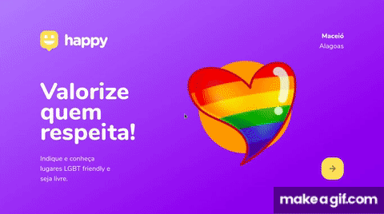

# Happy-place-app
An app to register LGBTQIA+ friendly places in Maceió, indicating their locations in a map and showing some informations about the place. The project uses a mobile first concept, so the app is responsible and works well on mobile devices.

## Tecnologies
- JavaScript
- Node.js
- Express
- SQLite
- Handlebars
- HTML
- CSS
- Leaflet (lib for interactive maps)

## Prerequisites
To run this project, you will need to have Git and Node installed in your machine.

## Installing
- Clone this repository:
  ```
  git clone https://github.com/RubensMario/happy-place-app.git
  ```
- Install the dependencies:
  ```
  npm install
  ```
- Run the app:
  ```
  npm start    
  ```

## Preview


## Author 
Rubens Mario  

## Acknowledgments
Project based on the Rocketseat [Next Level Week 3](https://nextlevelweek.com/) app.